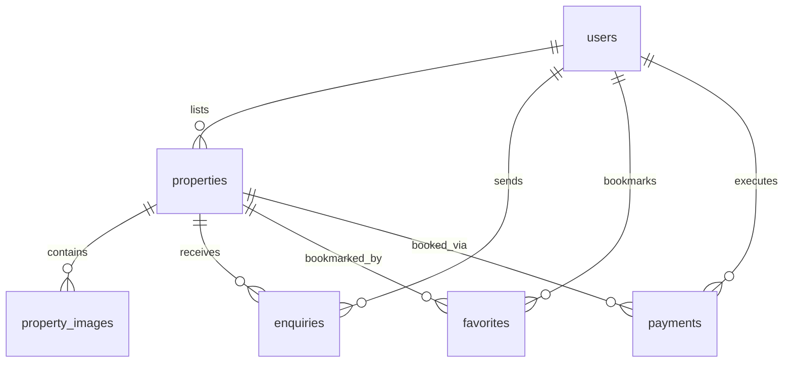

# Real_Estate_FullStack

# 🏡 Plotify Estates — Real Estate Listing & Payment Platform

Plotify Estates is a modern, responsive real estate web application that connects buyers and agents. The platform features an interactive property search engine, automated agent enquiry forms, and a secure payment gateway integration using **Razorpay** to lock/book properties online.

---

## ⚡ Key Features

### 👤 Role-Based Portals (RBAC)
*   **Buyers**: Browse properties, filter by category/city/BHK/price, manage bookmarks, send queries to agents, and securely lock properties with token payments.
*   **Listing Agents**: Publish, edit, and delete properties; view and manage client inquiries; review property booking transactions; and feature listings using promotional payments.
*   **Administrators**: Full system governance.

### 💳 Integrated Payment Gateway (Razorpay)
*   **Dynamic Booking Lock Fee**: Token amounts are calculated dynamically on checkout:
    *   **Rentals**: ₹2,000 lock fee (rent < ₹50,000) or ₹3,000 (rent ≥ ₹50,000).
    *   **Sales**: ₹10,000 lock fee (price < ₹2 Crores) or ₹12,000 (price ≥ ₹2 Crores).
*   **Listing Promotions**: Agents can pay a flat promotional fee of **₹1,000** to feature their listing at the top of all search results.
*   **Automatic Developer Sandbox**: Falls back to an interactive verification simulation if mock Razorpay credentials are used in `application.properties`.

---

## 🛠️ Technology Stack

### Backend
*   **Framework**: Spring Boot 3.x
*   **Security**: Spring Security + JSON Web Tokens (JWT) for stateless session authorization.
*   **Database ORM**: Hibernate / Spring Data JPA
*   **Database**: MySQL 8.x
*   **SDKs**: Razorpay Java SDK

### Frontend
*   **Framework**: React (Vite)
*   **Styling**: Vanilla CSS + TailwindCSS (harmonious HSL colors, modern typography, glassmorphism, responsive grids)
*   **Icons**: Lucide React
*   **HTTP Client**: Axios (configured with interceptors to automatically attach JWT tokens to all outgoing requests)

---

## 🗄️ Database Architecture


### Table Definitions:
1.  **`users`**: Stores client name, email, role (`BUYER`, `AGENT`, `ADMIN`), and contact details.
2.  **`properties`**: Holds listing information (price, type: `SALE`/`RENT`, location coordinates, status, `is_booked`, and `is_featured` badges).
3.  **`property_images`**: Multi-image URLs associated with a single listing.
4.  **`enquiries`**: Buyer-to-Agent message log records.
5.  **`favorites`**: Many-to-Many join table tracking user bookmarks.
6.  **`payments`**: Transaction records containing Razorpay order/payment references, signatures, status, type (`BOOKING`/`PREMIUM`), and amounts.

---

## ⚙️ Configuration & Installation

### 1. Database Setup
Ensure **MySQL Server** is running, then execute the **`real_estate_db_seed.sql`** script in **MySQL Workbench** to generate tables and populate test records.

### 2. Backend Config (`src/main/resources/application.properties`)
Open the properties file and configure your database credentials and Razorpay credentials:
```properties
# MySQL Connection Configuration
spring.datasource.url=jdbc:mysql://localhost:3306/real_estate_db?useSSL=false&serverTimezone=UTC
spring.datasource.username=your_mysql_username
spring.datasource.password=your_mysql_password

# JWT Token Secret
jwt.secret=9a3f982425a8dbb8e9b8f2d5e2195f12e87c2b3d4f5e6a7b8c9d0e1f2a3b4c5d

# Razorpay Configuration (Replace with keys from Razorpay Dashboard)
# Using 'rzp_test_dummykey123' will trigger mock simulator automatically
razorpay.key-id=rzp_test_dummykey123
razorpay.key-secret=dummykeysecret123
```

### 3. Running the Backend
In your terminal, navigate to the `backend` folder and run:
```bash
./mvnw.cmd spring-boot:run
```
The server will boot and listen on **`http://localhost:8080`**.

### 4. Running the Frontend
In your terminal, navigate to the `frontend` folder, install dependencies, and start the development server:
```bash
npm install
npm run dev
```
The client dashboard will compile and open on **`http://localhost:5173`**.

---

## 📡 API Reference

### 🔐 Authentication (`/api/auth`)
*   `POST /api/auth/register` - Create user profile (Buyer/Agent/Admin).
*   `POST /api/auth/login` - Obtain JWT Access Token.
*   `GET /api/auth/me` - Retrieve authenticated user context.

### 🏡 Properties (`/api/properties`)
*   `GET /api/properties` - List filtered listings (supports pagination, price range, city, BHK, and type).
*   `POST /api/properties` - Create property listing (Agent only).
*   `PUT /api/properties/{id}` - Modify listing details.
*   `DELETE /api/properties/{id}` - Remove listing details.

### 💳 Payments (`/api/payments`)
*   `POST /api/payments/create-order` - Generate Razorpay Order ID with calculated dynamic lock fee.
*   `POST /api/payments/verify` - Verify Razorpay signature and update property status.
*   `GET /api/payments/agent-bookings` - Fetch property bookings list for current agent.
*   `GET /api/payments/my-bookings` - Fetch booked properties list for current buyer.
